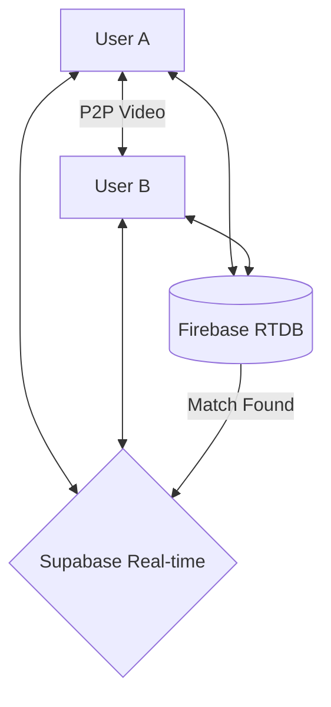

<p align="center">
  
</p>

<h1 align="center">✨ Livetalk by Likki ✨</h1>

<p align="center">
  <strong>The #1 Omegle Alternative — Where Privacy Meets Premium Human Connection.</strong><br>
  A high-performance, hybrid-powered anonymous video & text chat platform.
</p>

<p align="center">
  
  
  
  
  
  
</p>

---

## 🚀 Why Livetalk?

Livetalk reimagines the spontaneous nature of the early internet with modern security and a premium feel. No accounts. No logs. Just instant connection.

### 🌟 Key Features

| Feature | Description |
| :--- | :--- |
| ⚡ **Instant Match** | Powered by Firebase RTDB. No cold starts, just click and chat. |
| 🎥 **HD Video Calls** | Crystal clear peer-to-peer video with low-latency signaling. |
| 🛡️ **Zero-Log Privacy** | Aggressive transient data policy. Your metadata is wiped instantly. |
| 🎮 **In-Chat Games** | Play Tic-Tac-Toe mid-conversation without leaving the app. |
| 🌈 **Glassmorphic Themes** | Choose between **Ocean**, **Sunset**, **Neon**, and **Midnight**. |
| 🎭 **Mood Meter** | Share your vibe visually with a real-time interactive meter. |
| 📍 **Smart Interests** | Advanced matchmaking that prioritizes your passions. |
| 📱 **PWA Ready** | Install as a native app on iOS & Android for the full mobile experience. |

---

## 🛠️ Hybrid Architecture

Livetalk uses a unique **Dual-Backend Strategy** for maximum performance:

- **Firebase (Matchmaking & Signaling)**: Handles transient, real-time events. Pairing and WebRTC handshakes happen in milliseconds, not seconds.
- **Supabase (Real-time Messaging)**: Orchestrates the core chat engine, message persistence, and reactions.



---

## 🚦 Installation & Setup

### 1. Clone & Install
```bash
git clone https://github.com/likhith3035/ohmegle.git
cd ohmegle
npm install
```

### 2. Environment Setup
Copy the example file and fill in your own credentials:
```bash
cp .env.example .env
```
Fill in your `VITE_SUPABASE_*` and `VITE_FIREBASE_*` keys in the `.env` file.

### 3. Firebase Console Configuration
To ensure matchmaking works, set your **Realtime Database Rules** to allow transient signaling:
```json
{
  "rules": {
    "presence": { ".read": true, "$user_id": { ".write": "true" } },
    "lobby": { ".read": true, "$user_id": { ".write": "true" } },
    "matches": { ".read": true, "$match_id": { ".write": "true" } },
    "rooms": { ".read": true, "$room_id": { ".write": "true" } }
  }
}
```

### 4. Run Development Server
```bash
npm run dev
```

---

## 👨‍💻 Developer & Visionary

Developed with 💜 by **Likhith Kami**.

<a href="https://instagram.com/Lucky__likhith" target="_blank">
  
</a>
<a href="https://www.linkedin.com/in/likhith-kami/" target="_blank">
  
</a>
<a href="mailto:kamilikhith@gmail.com">
  
</a>

<p align="center">
  <i>"Connecting the world, one private conversation at a time."</i><br>
  <b>© 2026 Livetalk. All rights reserved.</b>
</p>
