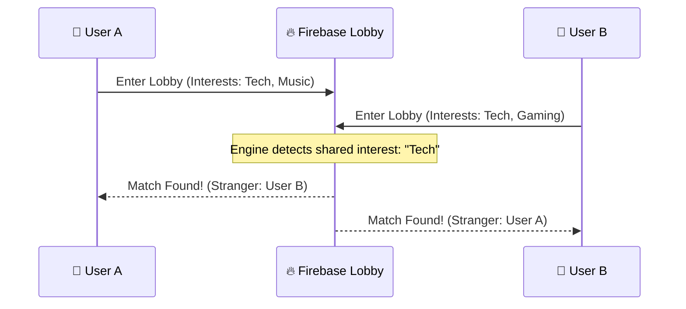
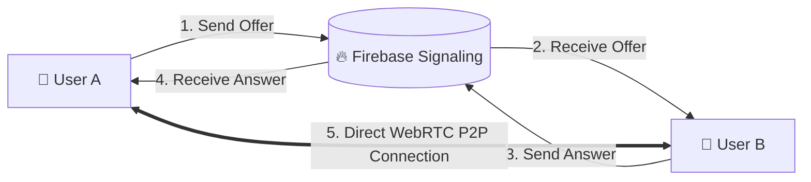

<h1 align="center">✨ Livetalk by Likki ✨</h1>

<p align="center">
  <strong>The #1 Omegle Alternative — Where Privacy Meets Premium Human Connection.</strong><br>
  A high-performance, hybrid-powered anonymous video & text chat platform engineered for the modern web.
</p>

<p align="center">
  
  
  
  
  
  
  
</p>

---

## 🚀 The Vision

Livetalk is built to bring back the raw, spontaneous, and private human connections of the early internet, but with the speed and elegance of the modern era. No accounts, no trackers, no historical logs. Just you and a stranger, connecting instantly.

---

## 🤝 How Matchmaking Works

Experience a seamless connection flow powered by our **Hybrid-Logic Engine**. 

### 1. The Matchmaking Pulse
When you click "Start", our system places you in a high-speed **Lobby** on Firebase. It instantly scans for other waiting users and prioritizes those with **Shared Interests**.



### 2. The Smart Handshake
Once matched, a private **Signaling Channel** is created. This is where the magic happens: users exchange encrypted "handshake" data (ICE Candidates) via Firebase to find the fastest direct path to each other.



### 3. Live Interaction
The moment you connect:
- **Video/Audio**: Streamed directly between you and the stranger (Peer-to-Peer).
- **Text Chat**: Handled by **Supabase Realtime** for lightning-fast message delivery and reactions.
- **Privacy Assurance**: All transient data in Firebase is **deleted the nanosecond** you are connected.

---

## 🌟 Premium Features

| Feature | Description | Technical Edge |
| :--- | :--- | :--- |
| ⚡ **Instant Match** | Connect with strangers across the globe in milliseconds. | Firebase RTDB optimized lobby. |
| 🎥 **HD Video Calls** | One-tap switch from text to high-latency video chat. | P2P WebRTC with Firebase signaling. |
| 🛡️ **Zero-Log Privacy** | Your data only exists as long as your conversation does. | Aggressive transient data policy. |
| 🎮 **In-Chat Games** | Break the ice with built-in games like Tic-Tac-Toe. | Real-time state syncing. |
| 🌈 **Glassmorphic UI** | Stunning themes like **Ocean**, **Sunset**, and **Midnight**. | Tailwind CSS + Framer Motion. |
| 🎭 **Mood Meter** | Express yourself with a real-time reactive mood indicator. | Live Supabase presence sync. |
| 📍 **Interest Match** | Find people who share your specific passions. | Weighted interest pairing logic. |
| 📱 **Full PWA Support** | Desktop-class experience on iOS and Android. | Service Worker optimization. |

---

## 🛡️ Privacy & Security First

- **Stateless Design**: We don't use databases for message history. Once you refresh or disconnect, the chat is gone forever.
- **Transient Signaling**: Firebase keys are only held in memory during the matchmaking phase and wiped the moment the connection is established.
- **Environment Isolation**: Critical API keys are managed via `.env` files to prevent exposure in open-source clones.

---

## 🚦 Installation & Setup

### 1. Prerequisite
Ensure you have **Node.js 18+** and a package manager installed.

### 2. Fast Track Setup
```bash
# Clone the repository
git clone https://github.com/likhith3035/ohmegle.git
cd ohmegle

# Install dependencies
npm install

# Setup environment variables
cp .env.example .env
```

### 3. Backend Configuration
- **Supabase**: Create a new project and add your URL/Anon Key to `.env`.
- **Firebase**: Enable **Realtime Database** and set location to `us-central1`. 
- **Security Rules**: Copy the rules from [DEVELOPMENT.md](./DEVELOPMENT.md) into your Firebase console.

### 4. Launch
```bash
npm run dev
```

---

## 🗺️ Future Roadmap

- [ ] **AI Voice Modulation** - Real-time voice effects during calls.
- [ ] **Global Translator** - Instant translation for international matches.
- [ ] **Augmented Reality** - Snapchat-style face filters during video calls.
- [ ] **Squad Rooms** - Topic-based group chats for 3-5 people.

---

## 👨‍💻 Developer & Visionary

Developed with 💜 by **Likhith Kami**.

<div align="center">
  <a href="https://instagram.com/Lucky__likhith" target="_blank">
    
  </a>
  <a href="https://www.linkedin.com/in/likhith-kami/" target="_blank">
    
  </a>
  <a href="mailto:kamilikhith@gmail.com">
    
  </a>
</div>

<p align="center">
  <br>
  <i>"Redefining human connection, one private conversation at a time."</i><br>
  <b>© 2026 Livetalk. Open Source. MIT License.</b>
</p>
